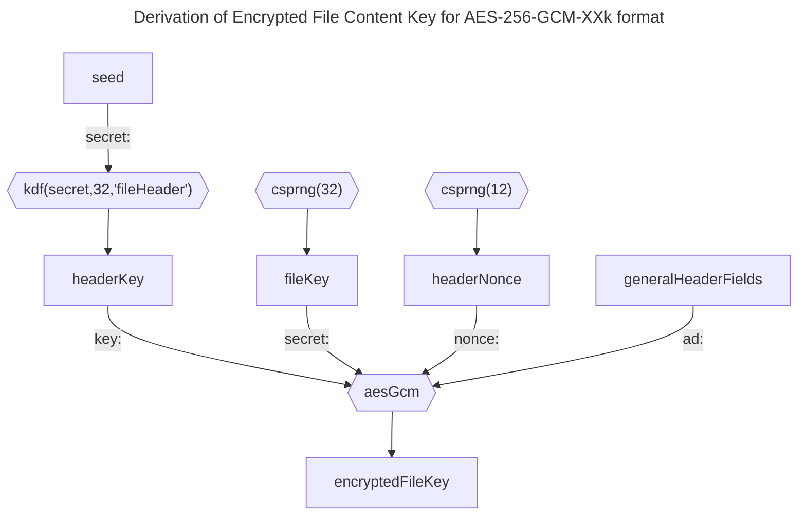
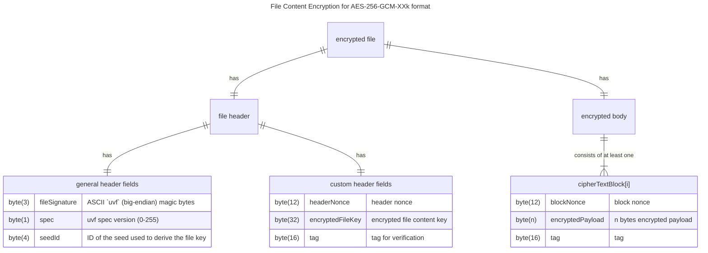

# File Content Encryption using AES-256-GCM

## Format-specific file header fields

Following the [_general header_ fields](README.md), this format requires 60 additional bytes for its _format-specific header_ fields:

* 12 byte nonce
* 32 byte encrypted file content key
* 16 byte tag

The header needs to be encrypted using a 256 bit key derived from the seed using the KDF defined in the [vault metadata file](../vault%20metadata/README.md).

```ts
let headerKey = kdf(secret: latestSeed, length: 32, context: "fileHeader")
let headerNonce = csprng(bytes: 12)
let fileKey = csprng(bytes: 32)
let [encryptedFileKey, tag] = aesGcm(cleartext: fileKey, key: headerKey, nonce: headerNonce, ad: generalHeaderFields)
let header = generalHeaderFields + headerNonce + encryptedFileKey + tag
```



## File Body Encryption

The body is split up into chunks. Each chunk consists of:

* 12 byte nonce
* `n` bytes encrypted payload (see subsections)
* 16 bytes tag

```ts
let blockSize = ...
let nBlocks = floor(length(cleartext) / blockSize) + 1
let cleartextBlocks[] = split(data: cleartext, maxBytes: blockSize)
for (let i = 0; i <= nBlocks; i++) {
    let blockNonce = csprng(bytes: 12)
    let ad = [bigEndian(i), headerNonce]
    let [ciphertextBlock, tag] = aesGcm(cleartext: cleartextBlocks[i], key: fileKey, nonce: blockNonce, ad: ad)
    ciphertextBlocks[i] = blockNonce + ciphertextBlock + tag
}
let body = join(ciphertextBlocks[])
```

### 32k

This variant uses 32740 payload bytes per block (resulting in 32768 encrypted bytes per chunk).

If the cleartext file size is a multiple of the cleartext block size (0, 32740, 65480, ... bytes), a zero-byte EOF block MUST be appended.

## Overview


